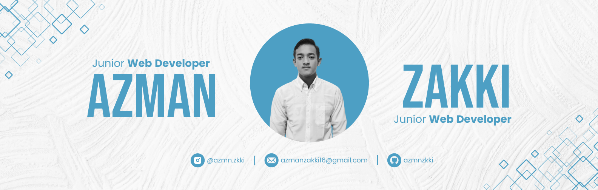

<h1 align="center"><b>Hellow Everyone I'm Azman Zakki </b></h1>
<!--  -->

  

 

	
## <picture></picture> **About me**

<picture> </picture>

 

- A passionate Self-taught Front-end developer
- Playing CTF's at spare time
- Currently learning Web Development by Self
- Currently working at SMA IT HSI Sukabumi as a Mentor Asisstant

  

  

## <b> Skills</b>
 

- **Languages**:
    
  

    
    
- **Front-End Development**:

   
   
   

 

- **Cloud Hosting**:

    
    
 

- **Softwares and Tools**:

    
    
    
    
    

-----

## <b> Let's Connect..!</b>
 

<ul>

 

 

	
</ul>

 

 
 
 

## <b>السَّلاَمُ عَلَيْكُمْ وَرَحْمَةُ اللهِ وَبَرَكَاتُهُ...✨</b>

 
 
 
 

---

 

**Credit:** [Azman Zakki](https://github.com/azmnzkki/azmnzkki)

**Last Edited on**: 25/07/2025
